# Présentation

FacturPro est un logiciel de devis et facturation conforme au droit français, utilisable depuis n'importe quel navigateur web. Il s'installe en une fois sur un poste Windows et est accessible localement par tous les postes du réseau.

## Conformité légale

| Exigence | Implémentation |
|---|---|
| **Loi anti-fraude TVA 2018** | Inaltérabilité des documents garantie par des verrous base de données + chaîne SHA-256 |
| **Factur-X / EN 16931** | Chaque facture embarque un XML ZUGFeRD lisible par les logiciels comptables |
| **FEC DGFiP** | Export Fichier des Écritures Comptables à tout moment, par exercice fiscal |
| **Clôture annuelle** | Procédure de clôture d'exercice avec Procès-Verbal horodaté (art. 88 loi 2015-1785) |
| **Mentions légales factures** | Escompte, pénalités de retard et indemnité forfaitaire automatiquement générées (art. L441-9/L441-10 CCom) |
| **e-invoicing 2026** | Intégration Chorus Pro / Portail Public de Facturation (dépôt XML Factur-X) |
| **RGPD** | Statuts clients, durée de conservation, anonymisation |
| **SEPA** | Fichiers de prélèvement pain.008.001.02 |

---

# Installation Windows

## Assistant d'installation

Double-cliquez sur `FacturPro-Setup.exe` et suivez les trois étapes de configuration.

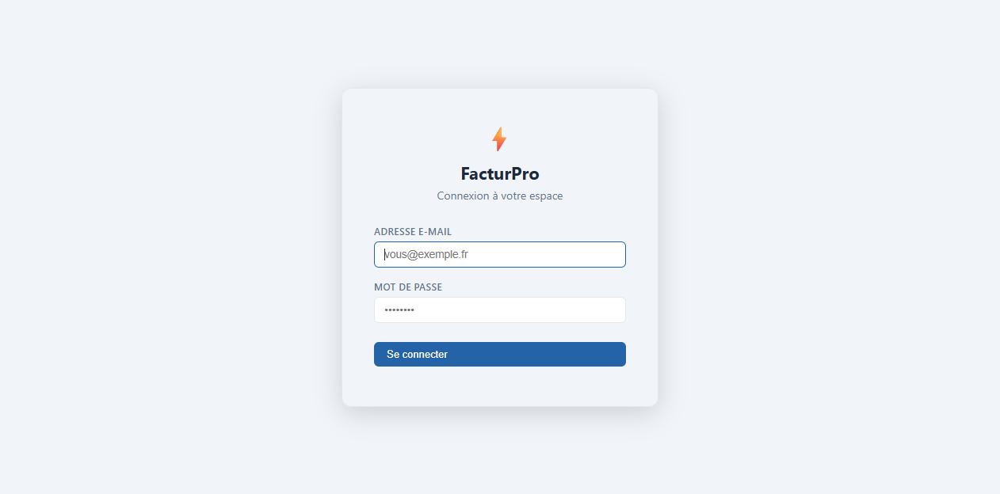

**Étape 1 — PostgreSQL**

| Champ | Valeur par défaut |
|---|---|
| Mot de passe `postgres` | `postgres` |

Si PostgreSQL 17 n'est pas installé, l'installeur le télécharge et l'installe automatiquement. **Ne modifiez pas le port PostgreSQL** (5432 par défaut).

**Étape 2 — Nom de votre société**

Saisissez la raison sociale exacte de votre entreprise. Elle sera utilisée pour créer la première société dans FacturPro et ne peut pas être vide.

**Étape 3 — Compte administrateur**

| Champ | Remarque |
|---|---|
| Adresse e-mail | Identifiant de connexion du super-administrateur |
| Mot de passe | Minimum 8 caractères, mémorisez-le |

**Étape 4 — Port TCP**

| Champ | Défaut | Plage |
|---|---|---|
| Port serveur | `3000` | 1024 – 65535 |

Changez le port si 3000 est déjà utilisé (Skype, IIS, autre logiciel). Le pare-feu Windows est configuré automatiquement.

## Après l'installation

- Le service Windows **FacturPro** démarre automatiquement à chaque démarrage du poste.
- L'interface est accessible à `http://localhost:<port>` depuis n'importe quel navigateur du réseau local.
- Logs : `<dossier_installation>\logs\app.log`

## Désinstallation

Via **Paramètres Windows > Applications**. La base de données PostgreSQL et les données **ne sont pas supprimées** automatiquement — exportez vos données avant.

---

# Première connexion

## Écran de connexion

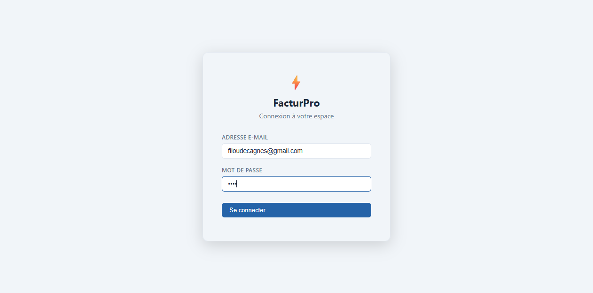

Saisissez l'adresse e-mail et le mot de passe configurés pendant l'installation. Si vous avez plusieurs sociétés, un sélecteur apparaît après la saisie du mot de passe.

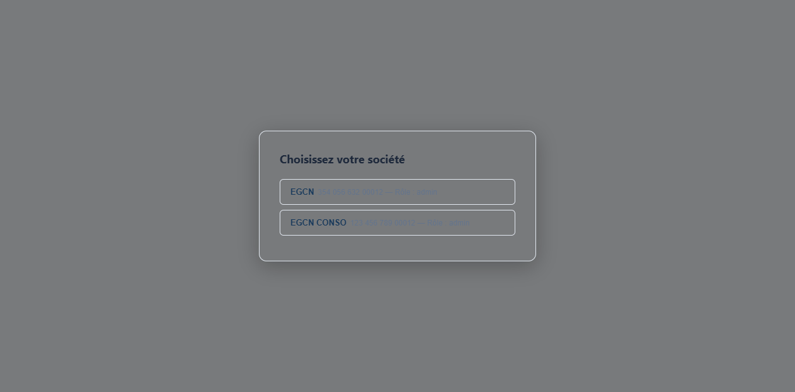

## Changer son mot de passe

Menu utilisateur (en bas de la barre latérale) **> Modifier le mot de passe**. L'ancien mot de passe est requis.

---

# Interface générale

## Tableau de bord

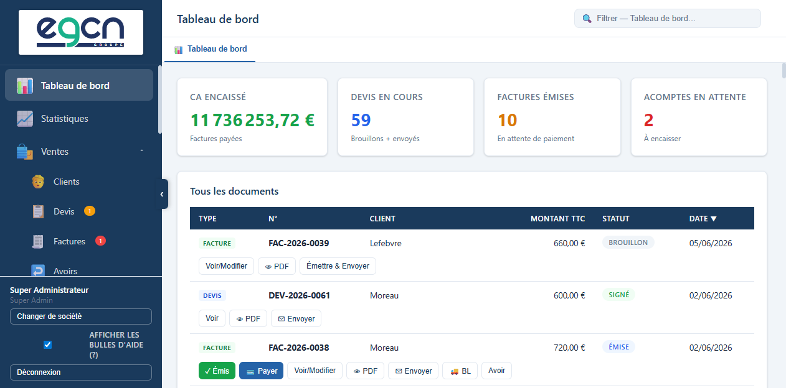

La page d'accueil affiche :

- **Chiffres du mois** : devis en cours, factures émises, montant encaissé.
- **Liste chronologique** de tous les documents récents (devis, factures, avoirs, acomptes, BL) avec statut, montant et boutons d'action directs.
- **Badges de notification** sur les entrées de navigation : nombre de factures en retard (rouge) et devis expirés (orange), mis à jour toutes les 5 minutes.

## Navigation latérale

La barre de gauche donne accès à toutes les rubriques, regroupées par catégories repliables. Sur mobile ou petit écran, elle se replie avec le bouton **☰** et peut être rouverte avec le même bouton.

Trois rubriques restent toujours visibles en haut de la barre :

| Icône | Rubrique |
|---|---|
| 📊 | Tableau de bord |
| 📈 | Statistiques |
| ⚙️ | Paramètres |

Les autres rubriques sont organisées en **catégories cliquables** (icône **▾**) qui se déplient pour révéler leurs sous-rubriques ; cliquer à nouveau sur l'en-tête de catégorie la replie :

**🛍️ Ventes ▾**

| Icône | Rubrique |
|---|---|
| 🧑 | Clients |
| 📋 | Devis |
| 🧾 | Factures |
| ↩️ | Avoirs |
| 💰 | Acomptes |
| 🚚 | Bons de livraison |
| 📦 | Articles |

**🛒 Achats ▾**

| Icône | Rubrique |
|---|---|
| 🏭 | Fournisseurs |
| 📝 | Commandes |
| 📥 | Factures d'achats |

**🧮 Comptabilité ▾**

| Icône | Rubrique |
|---|---|
| 📑 | Déclaration TVA |
| ⚖️ | Lettrage |
| 📅 | Exercices |
| 🗄️ | Archives |
| 🔍 | Journal d'audit |

> Ce regroupement par catégories simplifie la navigation : seules les rubriques de la catégorie ouverte sont affichées, ce qui réduit l'encombrement de la barre latérale au quotidien.

## Onglets de travail

Chaque document ouvert s'affiche dans un **onglet persistant** en haut de l'écran. Les onglets sont conservés au rechargement — vous retrouvez exactement votre contexte. Un onglet non sauvegardé (brouillon) est également restauré.

**Raccourcis clavier** disponibles dans l'éditeur de documents :

| Raccourci | Action |
|---|---|
| `Ctrl+S` | Enregistrer le document |
| `Ctrl+P` | Imprimer (aperçu PDF) |

## Recherche globale (v3.2.11)

Le champ **🔍** en haut de l'écran a un double rôle :

- Sur une liste ou un document ouvert, il **filtre instantanément les lignes affichées** (comportement inchangé).
- À partir de **2 caractères**, il déclenche en plus une **recherche globale** dans toute votre société : devis, factures, bons de livraison, acomptes, clients, articles, commandes fournisseurs et factures d'achats.

Les résultats apparaissent dans un menu déroulant, **regroupés par type** avec une icône, le libellé (numéro/nom) et une information complémentaire (montant, statut). Cliquez sur un résultat — ou naviguez avec les flèches **↑ / ↓** puis **Entrée** — pour ouvrir directement le document correspondant ou la fiche du client/article. **Échap** ou un clic en dehors referme le menu.

---

# Configuration de l'entreprise

Avant de créer le premier document, renseignez les informations de votre société dans **Paramètres**.


## Informations légales

| Champ | Remarque |
|---|---|
| Raison sociale | Dénomination exacte telle qu'au SIRET |
| Forme juridique | SAS, SARL, EI, EURL, etc. |
| Mention EI | Cocher si entrepreneur individuel — adapte automatiquement les mentions légales |
| SIRET | 14 chiffres |
| N° TVA intracommunautaire | FR + 2 chiffres + SIREN |
| Régime TVA | Normal, Franchise art. 293 B, ou Autoliquidation |
| Capital social / RCS | Figurent en pied de page des documents |

## Logo

Cliquez **Importer un logo** pour déposer votre fichier (PNG, JPEG, WebP — 2 Mo max). Le logo est intégré en haut de tous les PDFs et sa **couleur dominante est extraite automatiquement** pour habiller les en-têtes de tableaux.

## Email / SMTP

Sans configuration SMTP, les emails sont envoyés via un compte de test Ethereal (lien de prévisualisation affiché, emails non délivrés réellement).

| Champ | Exemple |
|---|---|
| Mode | SMTP — Envoi automatique |
| Hôte SMTP | `smtp.gmail.com` |
| Port | `587` (STARTTLS) ou `465` (SSL) |
| Utilisateur | `facturation@modomaine.fr` |
| Mot de passe | Mot de passe ou token d'application |

Pour Gmail, créez un **mot de passe d'application** dans les paramètres de sécurité Google (compte > Sécurité > Mots de passe des applications).

## Coordonnées bancaires SEPA

Requis pour la génération de fichiers de prélèvement SEPA.

| Champ | Remarque |
|---|---|
| IBAN | IBAN de votre compte receveur |
| BIC | BIC/SWIFT de votre banque |
| ICS | Identifiant Créancier SEPA — **obligatoire** — obtenu auprès de votre banque |

## CGV et mentions légales

La section **CGV et mentions légales** dans les Paramètres permet de renseigner deux textes qui s'impriment automatiquement en bas de chaque document PDF :

- **Mention légale** (ligne de titre, en gras) : ex. `RCS Paris B 123 456 789 — Capital social : 10 000 €`
- **CGV** (texte long) : vos conditions générales de vente complètes

## Mentions légales obligatoires sur les factures


Depuis **Paramètres > Mentions légales obligatoires** (nouveau en v2.13.0), configurez les valeurs par défaut qui seront pré-remplies sur chaque nouvelle facture :

| Champ | Valeur légale recommandée |
|---|---|
| Pénalités de retard | `Taux directeur BCE majoré de 10 points` (art. L441-10 CCom) |
| Indemnité forfaitaire de recouvrement | `40` € (fixé par décret, obligatoire en B2B) |
| Escompte par défaut | `0` (si vous n'accordez pas d'escompte) |

Ces valeurs apparaissent automatiquement dans le pied de page de chaque facture PDF et sont modifiables facture par facture.

## Relances automatiques

Depuis **Paramètres > Relances automatiques**, activez l'envoi automatique d'emails de relance pour les factures impayées :

| Champ | Remarque |
|---|---|
| Activer | Cocher pour activer |
| Relancer après N jours de retard | Ex. `15` — le système attend 15 jours après l'échéance avant la première relance |
| Heure d'envoi | Ex. `08:00` — heure à laquelle le serveur envoie les relances quotidiennement |

> Les relances s'appuient sur le SMTP configuré. Sans SMTP, elles sont envoyées via Ethereal (test uniquement). Le compteur de relances est incrémenté et la date de dernière relance est enregistrée sur chaque facture.

## Notifications avant échéance

En plus des relances après retard, FacturPro peut envoyer un **email de rappel avant l'échéance** :

| Champ | Remarque |
|---|---|
| Activer les notifications | Cocher pour activer |
| Jours avant échéance | Ex. `3` — l'email est envoyé 3 jours avant la date d'échéance |

Le rappel est envoyé **au plus une fois par facture**. Si la facture est payée avant l'envoi, aucun email n'est émis.

---

# Gestion des clients

## Liste des clients

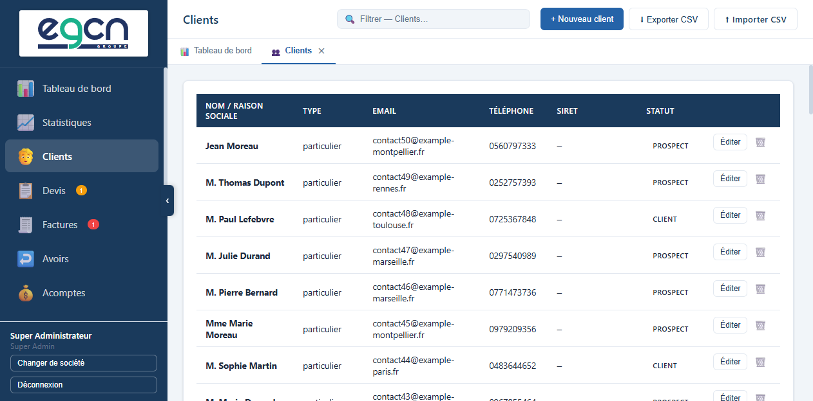

La liste affiche tous les clients actifs (les clients anonymisés RGPD n'apparaissent plus). Utilisez la barre de recherche pour filtrer par nom, raison sociale ou ville.

---

## Fiche client — mouvements et KPIs

Cliquez sur le **nom du client** ou sur le bouton **Fiche** pour ouvrir un tableau de bord dédié à ce client.

### Ouvrir la fiche

- **Clic sur le nom** (affiché en bleu dans la liste)
- **Bouton Fiche** sur la ligne du client

### KPIs par période

Trois onglets permettent de basculer instantanément entre les périodes sans rechargement :

| Onglet | Périmètre |
|---|---|
| Année N | Exercice en cours (ex. 2026) |
| Année N-1 | Exercice précédent (ex. 2025) |
| Tout | Depuis la création du compte client |

Pour chaque période, quatre indicateurs sont affichés :

| Indicateur | Définition |
|---|---|
| CA HT | Montant HT des factures émises et payées (avoirs exclus) |
| Avoirs HT | Montant HT des avoirs émis |
| CA Net HT | CA HT − Avoirs HT |
| Encours TTC | Factures émises non encore payées |
| En retard TTC | Encours dont la date d'échéance est dépassée |

### Tableau des documents

La fiche liste l'ensemble des devis, factures, acomptes et bons de livraison du client, triés par date décroissante. Cliquer sur une ligne ouvre directement le document.

---

## Créer un client

Cliquez **+ Nouveau client**. Deux types :

- **Professionnel** — raison sociale, SIRET, TVA intracom.
- **Particulier** — civilité, prénom, nom.

Les champs **adresse**, **code postal** et **ville** sont obligatoires (ils figurent sur les documents).

### Calcul automatique de TVA intracom

Lorsque vous saisissez un **SIRET** et quittez le champ, FacturPro calcule automatiquement le numéro de TVA intracommunautaire (uniquement si le champ TVA est encore vide) :

```
Clé = (12 + 3 × (SIREN mod 97)) mod 97
N° TVA = "FR" + clé (2 chiffres) + SIREN
```

Exemple : SIRET `12345678900014` → SIREN `123456789` → clé `(12 + 3×789 mod 97) mod 97 = 12` → TVA `FR12123456789`.

### Mode de règlement par défaut

Pré-sélectionné automatiquement lors de la création d'une facture pour ce client. Évite de ressaisir le mode à chaque fois.

| Mode | Code |
|---|---|
| Virement bancaire | `virement` |
| Virement SEPA | `virement_sepa` |
| Prélèvement SEPA | `prelevement_sepa` |
| Chèque | `cheque` |
| Espèces | `especes` |
| Carte bancaire | `carte` |

### Section SEPA client

Pour les clients payant par prélèvement SEPA, renseignez dans la fiche client :

| Champ | Remarque |
|---|---|
| IBAN | IBAN du compte à débiter |
| BIC | BIC/SWIFT de la banque du client |
| Titulaire du compte | Peut différer de la raison sociale |
| Référence mandat (RUM) | Référence unique du mandat signé par le client |
| Date de signature | Date à laquelle le client a signé le mandat |
| Type | `CORE` (standard) ou `B2B` (interentreprises) |

### RGPD

| Statut | Signification |
|---|---|
| Prospect | Contact initial, pas encore de document signé |
| Client actif | Au moins un devis accepté |
| Inactif | Aucune activité récente |
| Anonymisé | Données personnelles effacées (conservation légale 10 ans) |

Le statut passe automatiquement de *Prospect* à *Client actif* lors de l'acceptation d'un devis.

---

## Import CSV clients

L'import CSV permet de créer des dizaines ou centaines de clients en une seule opération.

### Accès

**Clients > Importer CSV** (bouton dans la barre d'outils).

### Format attendu

Le fichier doit être encodé en **UTF-8** (sans BOM), séparateur **point-virgule (`;`)**, avec en-têtes en première ligne.

**Fichier d'exemple** : `docs/exemples/clients-import-exemple.csv`

**En-têtes acceptées** (ordre libre) :

| Colonne | Obligatoire | Valeurs acceptées | Exemple |
|---|---|---|---|
| `Type` | Non | `professionnel` ou `particulier` | `professionnel` |
| `Raison_sociale` | Si professionnel | Texte libre | `Dupont & Associés SAS` |
| `Civilite` | Si particulier | `M.`, `Mme`, `Dr`… | `M.` |
| `Prenom` | Si particulier | Texte libre | `Jean` |
| `Nom` | Si particulier | Texte libre | `Dupont` |
| `Adresse` | **Oui** | Texte libre | `12 rue de la Paix` |
| `Adresse2` | Non | Complément | `Bât. C Appt 12` |
| `Code_postal` | **Oui** | Texte libre | `75001` |
| `Ville` | **Oui** | Texte libre | `Paris` |
| `Pays` | Non | Défaut : `France` | `France` |
| `Email` | Non | Adresse valide | `contact@exemple.fr` |
| `Telephone` | Non | Texte libre | `01 42 00 00 01` |
| `SIRET` | Non | 14 chiffres (espaces ignorés) | `12345678900014` |
| `TVA_Intracom` | Non | FR + clé + SIREN | `FR12123456789` |
| `Mode_TVA` | Non | `normal`, `franchise_293b`, `autoliquidation` | `normal` |
| `Mode_reglement` | Non | Voir tableau modes | `virement` |
| `Statut_RGPD` | Non | `prospect`, `client`, `inactif` | `client` |

### Exemple de fichier

```csv
Type;Raison_sociale;Civilite;Prenom;Nom;Adresse;Adresse2;Code_postal;Ville;Pays;Email;Telephone;SIRET;TVA_Intracom;Mode_TVA;Mode_reglement;Statut_RGPD
professionnel;Dupont & Associés SAS;;; ;12 rue de la Paix;;75001;Paris;France;contact@dupont-assoc.fr;01 42 00 00 01;12345678900014;FR12123456789;normal;virement;client
particulier;;M.;Jean;Lefebvre;8 allée des Roses;Bât. C Appt 12;33000;Bordeaux;France;jean.lefebvre@email.com;06 12 34 56 78;;;normal;virement;client
```

### Déroulement de l'import

1. Préparez votre fichier CSV (dans Excel : `Fichier > Enregistrer sous > CSV UTF-8 séparé par des virgules`, puis remplacez les virgules par des points-virgules).
2. Cliquez **Importer CSV** dans la liste des clients.
3. Sélectionnez votre fichier.
4. Patientez — FacturPro insère les lignes une par une et affiche un rapport :

```
Import terminé :
  ✓ 45 clients créés
  ✗  3 lignes ignorées :
     Ligne 12 : adresse, code postal et ville obligatoires
     Ligne 28 : email invalide
     Ligne 31 : adresse, code postal et ville obligatoires
```

### Erreurs fréquentes

| Erreur | Cause | Solution |
|---|---|---|
| "adresse, code postal et ville obligatoires" | Une des trois colonnes est vide | Compléter la colonne manquante |
| Caractères corrompus (â, é→é) | Mauvais encodage | Enregistrer en UTF-8 dans l'éditeur de texte |
| Ligne ignorée sans message | SIRET en doublon (ON CONFLICT DO NOTHING) | Supprimer le doublon du fichier |
| Colonne non reconnue | Nom de colonne mal orthographié | Vérifier les en-têtes (casse insensible) |

> **Astuce Excel :** Ouvrez Excel, allez dans `Données > À partir d'un fichier texte/CSV`, choisissez le séparateur `;` et l'encodage UTF-8. Modifiez, puis exportez avec **Fichier > Enregistrer sous > CSV UTF-8**.

## Export CSV clients

**Clients > Exporter CSV** — télécharge tous les clients non-anonymisés au même format que l'import. Idéal pour une migration ou une synchronisation avec un autre outil.

---

# Catalogue d'articles

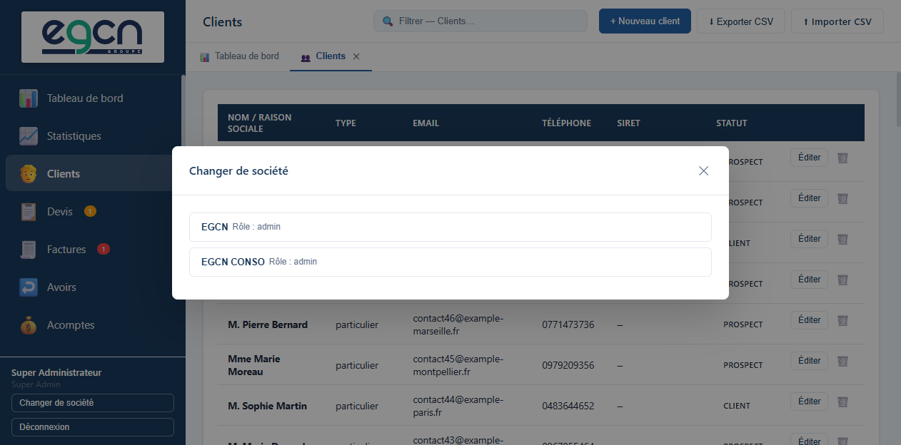

## Rechercher et trier

### Barre de recherche

En haut de la liste, un champ de recherche filtre instantanément les articles sur leur **référence**, leur **désignation** ou leur **description**. Le filtrage est côté client — aucun rechargement réseau.

### Tri par colonne

Cliquez sur n'importe quel en-tête de colonne pour trier la liste (▲ = croissant, ▼ = décroissant). Second clic : inverse le sens. Colonnes triables : Réf., Désignation, Unité, Prix vente HT, Prix achat HT, Marge, TVA, Stock.

---

## Fiche article

Cliquez sur le **nom d'un article** ou sur le bouton **Fiche** pour ouvrir un modal récapitulatif :

| Zone | Contenu |
|---|---|
| KPIs | Nombre de devis, nombre de factures émises/payées, quantité vendue totale, CA HT généré |
| Infos tarifaires | Prix vente, prix achat, marge brute, taux de marque, taux de marge, TVA, stock |
| Dernière utilisation | Date du document le plus récent utilisant cet article |
| Documents récents | Tableau des 20 derniers devis et factures, avec lien direct vers chacun |

> Les statistiques ne comptent que les factures de type **emise** ou **payee** (avoirs exclus). Cliquer sur une ligne du tableau ouvre directement l'éditeur du document.

---

## Créer un article

| Champ | Remarque |
|---|---|
| Référence | Optionnel, libre (ex. `PREST-001`) |
| Désignation | Affiché sur les documents |
| Description | Texte long, imprimé sous la désignation en petit |
| Unité | heure, jour, forfait, pièce, m², km… |
| Prix unitaire HT | Valeur par défaut à l'insertion dans un document |
| Prix d'achat HT | Confidentiel — sert uniquement au calcul de marge |
| Taux TVA | Taux pré-sélectionné dans les lignes |
| Stock | Quantité disponible (optionnel) |
| Actif | Décocher pour masquer sans supprimer |

### Calcul de marge en temps réel

Quand un prix d'achat est renseigné, le formulaire affiche instantanément :

| Indicateur | Formule | Couleur |
|---|---|---|
| Marge brute | Prix vente − Prix achat | Vert si > 0, rouge si < 0 |
| **Taux de marque** | Marge ÷ Prix vente × 100 | Taux le plus utilisé en commerce |
| Taux de marge | Marge ÷ Prix achat × 100 | Utilisé en industrie |

> Le prix d'achat n'apparaît jamais sur les documents envoyés aux clients.

---

## Import CSV articles

Importez votre catalogue en une seule opération depuis un fichier CSV.

### Accès

**Articles > Importer CSV**.

### Format attendu

Même principe que pour les clients : UTF-8, séparateur `;`.

**Fichier d'exemple** : `docs/exemples/articles-import-exemple.csv`

**En-têtes acceptées** :

| Colonne | Obligatoire | Valeurs acceptées | Exemple |
|---|---|---|---|
| `Reference` | Non | Texte libre | `PREST-001` |
| `Designation` | **Oui** | Texte libre | `Prestation de conseil` |
| `Description` | Non | Texte long | `Conseil et expertise métier` |
| `Unite` | Non | Texte libre | `jour`, `heure`, `forfait`, `pièce` |
| `Prix_HT` | Non | Nombre décimal (`.` ou `,`) | `850` ou `850.00` |
| `Prix_Achat_HT` | Non | Nombre décimal | `600` |
| `TVA_Pct` | Non | Taux en % (`20`, `10`, `5.5`, `2.1`, `0`) | `20` |
| `Stock` | Non | Entier ou vide | `100` |
| `Actif` | Non | `1` (actif) ou `0` (inactif) | `1` |

### Exemple de fichier

```csv
Reference;Designation;Description;Unite;Prix_HT;Prix_Achat_HT;TVA_Pct;Stock;Actif
PREST-CONS;Prestation de conseil;Conseil et expertise métier;jour;850;0;20;0;1
FORM-001;Formation présentielle;Journée de formation en salle (10 pers. max);forfait;1200;0;20;0;1
HEB-MENS;Hébergement mensuel;Serveur dédié - 99,9% disponibilité;mois;299;180;20;0;1
```

### Comportement

- Si un article avec la même **désignation** existe déjà dans le catalogue, la ligne est **ignorée** silencieusement (`ON CONFLICT DO NOTHING`).
- Le rapport d'import indique le nombre d'articles créés et les lignes ignorées.
- Les articles importés sont **actifs** par défaut (sauf si `Actif=0`).

### Correspondance des taux TVA

| Valeur CSV | Taux dans FacturPro |
|---|---|
| `20` | TVA normale 20% |
| `10` | TVA intermédiaire 10% |
| `5.5` | TVA réduite 5,5% |
| `2.1` | TVA particulière 2,1% |
| `0` | Exonéré |

> Si le taux indiqué n'existe pas dans FacturPro, le premier taux disponible est utilisé par défaut.

## Export CSV articles

**Articles > Exporter CSV** — exporte les articles actifs au format compatible avec l'import.

---

# Éditeur de documents (WYSIWYG)

Tous les documents s'ouvrent dans un éditeur visuel A4 qui reproduit l'aspect exact du PDF final — côté ventes (devis, factures, avoirs, bons de livraison) comme côté achats (bons de commande et factures d'achats, voir le chapitre *Achats*).

## Devis

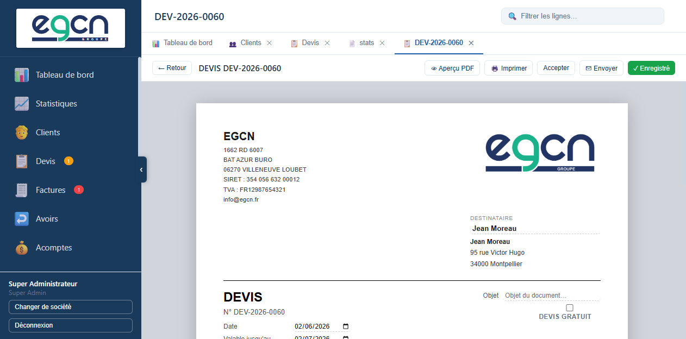

## Factures


## Saisie des lignes

| Colonne | Remarque |
|---|---|
| Désignation | Texte de la prestation ou du produit |
| Description (icône +) | Détail optionnel, imprimé sous la désignation en plus petit |
| Qté | Quantité |
| P.U. HT | Prix unitaire hors taxe |
| Remise % | Remise en pourcentage sur la ligne |
| TVA | Taux sélectionnable dans un menu |
| Total HT | Calculé automatiquement |

Les totaux (HT, TVA par taux, TTC) sont recalculés en temps réel.

### Champ Description masqué au survol (v3.2.10)

Pour alléger l'affichage, le champ **Description** d'une ligne reste **masqué tant qu'il est vide**. Il **apparaît au survol de la ligne** (ou lors de la saisie), pour permettre de le compléter sans encombrer la vue. Dès qu'une description est saisie, le champ **reste affiché en permanence**, même hors survol.

### Insérer un article du catalogue

Dans le champ **Désignation**, commencez à taper le nom — un menu de saisie semi-automatique filtre le catalogue. Cliquer sur un article pré-remplit désignation, description, prix et TVA.

### Réordonner les lignes

Chaque ligne dispose d'une **poignée de glisser-déposer** (icône ⠿ à gauche). Faites glisser la ligne à la position souhaitée — les totaux et les indicateurs de saut de page se recalculent automatiquement.

## Sélection du client

Le champ **Client** est un filtre de recherche : saisissez quelques lettres pour filtrer. L'option **+ Nouveau client** en bas de liste permet de créer un client à la volée.

## Sauts de page

L'éditeur affiche des **indicateurs visuels de saut de page** (ligne pointillée + label `— Page 2 —`) aux mêmes endroits que dans le PDF généré. Ils se mettent à jour à chaque modification de ligne.

## Nouveaux champs sur les factures (v2.13.0)


| Champ | Où | Description |
|---|---|---|
| **N° commande** | En-tête de la facture | Référence du bon de commande client (art. L441-9 CCom) — apparaît dans l'en-tête du PDF |
| **Escompte (%)** | Métadonnées | Taux d'escompte pour paiement anticipé — affiché dans le pied de page du PDF avec le montant calculé |
| **Pénalités de retard** | Pré-rempli depuis les paramètres | Modifiable par facture — imprimé en pied de page |

---

# Devis

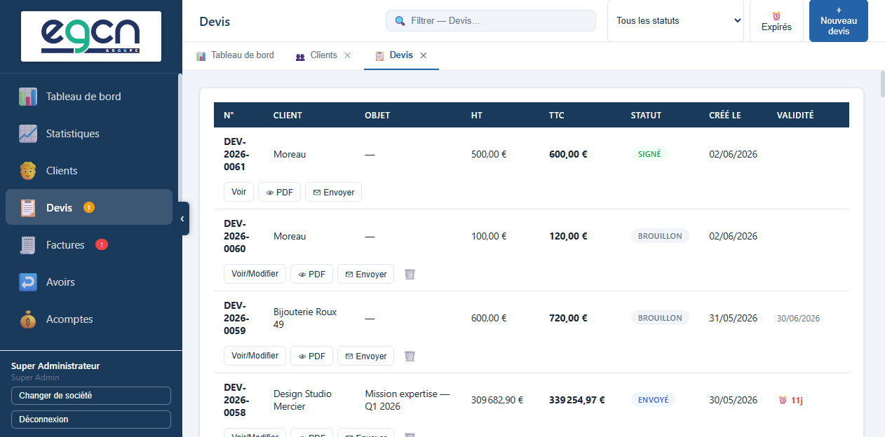

## Cycle de vie

```
Brouillon ──► Envoyé ──► Accepté (signé = verrouillé)
                │                └──► Bon de livraison (optionnel)
                │                └──► Facture
                └──► Refusé
```

## Créer un devis

1. **Devis > + Nouveau devis**
2. Sélectionnez le **client** via la recherche filtrée.
3. Renseignez **objet**, **date de validité**, **conditions de paiement**.
4. Ajoutez les lignes (désignation, quantité, prix HT, TVA, remise).
5. Cliquez **Enregistrer** — le numéro `DEV-2026-0001` est attribué au premier enregistrement.

La case **Devis gratuit** est cochée par défaut — décochez-la pour activer la tarification.

## Envoyer un devis

Bouton **Envoyer** dans la barre d'outils :

- Passe le statut à `envoyé`.
- Si un email client est renseigné, propose l'envoi par email avec le PDF joint.

## Accepter un devis

Bouton **Accepter** :

- Verrouille le devis (statut `signé`).
- Le statut RGPD du client passe automatiquement de *Prospect* à *Client actif*.
- Les boutons **Créer un BL** et **Créer la facture** apparaissent dans la barre.

## Signature électronique (v2.13.0)

Le bouton **✍ Envoyer lien de signature** (disponible sur les devis envoyés) permet à votre client de signer électroniquement depuis son navigateur, sans logiciel tiers.

**Flux de signature :**

1. Vous cliquez **Envoyer lien de signature** → un email est envoyé au client avec un lien unique.
2. Le client clique le lien → une page de signature s'ouvre dans son navigateur.
3. Il confirme → le devis passe automatiquement au statut **Accepté**.
4. L'IP, le nom et l'horodatage sont enregistrés sur le devis pour traçabilité.

> **Sécurité :** Le lien contient un UUID unique généré à la création du devis. Il ne peut être utilisé qu'une seule fois. Toute tentative avec un lien déjà utilisé affiche "Ce devis a déjà été signé le..."

## Dupliquer

Bouton **Dupliquer** : crée un devis `brouillon` avec les mêmes lignes — idéal pour créer des variantes.

## Convertir en bon de livraison

Depuis un devis accepté : **Créer un BL** → BL pré-rempli avec les lignes du devis.

## Convertir en facture

Depuis un devis accepté : **Créer la facture** → facture pré-remplie.

## Télécharger le PDF

Bouton **PDF** → télécharge le PDF généré (ou l'aperçu si non encore émis).

---

# Avenants

Un avenant modifie un devis accepté sans altérer l'original.

## Créer un avenant

Depuis la barre d'outils d'un devis accepté : **Nouvel avenant**.

| Champ | Remarque |
|---|---|
| Motif | Obligatoire — justification de la modification |
| Lignes | Modifications par rapport au devis initial (ajout, suppression, modification de prix) |
| Delta montant | Calculé automatiquement |

L'avenant suit le même cycle : `brouillon → envoyé → signé`. Une fois signé, il est verrouillé.

---

# Factures

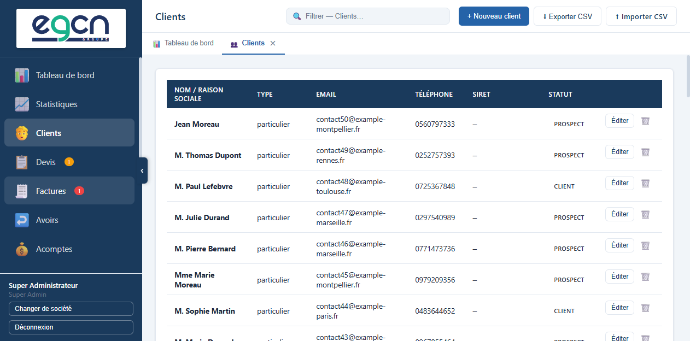

## Cycle de vie

```
Brouillon ──► Émise (verrouillée) ──► Payée
```

Une fois **émise**, la facture est verrouillée définitivement. Pour annuler, créez un avoir.

## Créer une facture

Depuis un devis accepté (**Créer la facture**), depuis un BL (**Créer la facture**), ou directement **Factures > Nouvelle facture**.

### Mentions légales obligatoires

Depuis v2.13.0, chaque facture dispose des champs légaux obligatoires (art. L441-9/L441-10 CCom) :

| Champ | Valeur par défaut (depuis paramètres) | Modifiable |
|---|---|---|
| **N° commande client** | Vide | Oui — saisir la référence du bon de commande reçu |
| **Escompte (%)** | 0 ou valeur paramétrique | Oui — ex. `2.5` pour 2,5% |
| **Pénalités de retard** | `Taux directeur BCE + 10 points` | Oui |
| **Indemnité forfaitaire** | `40 €` | Non modifiable par facture (paramètre global) |

Ces mentions apparaissent automatiquement dans le pied de page du PDF :

```
Pas d'escompte pour paiement anticipé.
Pénalités de retard : Taux directeur BCE majoré de 10 points —
Indemnité forfaitaire de recouvrement : 40 € (art. L441-10 C.com.)
```

## Émettre une facture

Le bouton **Émettre** :

1. Verrouille la facture (aucune modification possible ensuite).
2. Génère le **PDF Factur-X** (PDF + XML EN 16931 embarqué).
3. Inscrit les **écritures FEC** (journal VT — Ventes).
4. Enregistre un **scellement SHA-256** dans la chaîne d'intégrité.
5. Archive un snapshot JSON du document (conservation 10 ans).

## Marquer comme payée

Bouton **Enregistrer le paiement** : date de paiement + mode. Déclenche automatiquement :

- Écritures de règlement au FEC (journal BQ — Banque)
- Lettrage automatique des lignes 411 de l'émission et du règlement

### Déduire un acompte lors du paiement

Si un ou plusieurs acomptes ont été encaissés pour ce client, un sélecteur apparaît dans la modale de paiement :

1. Sélectionnez l'acompte à imputer.
2. Le **solde restant** est calculé en temps réel : `Montant facture − Acompte`.
3. Cliquez **Confirmer**.

**Cas particulier — acompte supérieur à la facture** : si l'acompte dépasse le montant de la facture, FacturPro crée automatiquement un **acompte reliquat** immédiatement encaissé (noté `Reliquat — AC-XXXX`), représentant le trop-perçu disponible pour une prochaine facture.

Le PDF de la facture affiche alors deux lignes supplémentaires dans le bloc totaux :
- *Acompte versé* : montant imputé
- *Solde à payer* : montant restant dû (ou 0,00 €)

## Envoyer par email

- **Envoyer** : envoie au email du client en base.
- **Envoyer à…** : saisissez l'adresse manuellement.
- **Relancer** : email de relance avec sujet/corps personnalisables et PDF joint.
- **Ouvrir dans Outlook** (Windows) : ouvre le client mail avec l'email pré-composé via MAPI.
- **Télécharger .eml** : fichier email téléchargeable pour envoi depuis n'importe quel client mail.

## Envoi groupé

Dans la liste, cochez plusieurs factures `émises`, puis cliquez **Envoyer la sélection (N)** dans la barre d'outils — un email est envoyé à chaque client avec sa facture.

## Dépôt Chorus Pro (e-invoicing 2026)

Si votre client est une entité publique ou si vous participez au déploiement progressif de la facture électronique obligatoire, le bouton **Déposer Chorus Pro** soumet la facture au Portail Public de Facturation.

**Prérequis** : définir dans `.env` :
```
CHORUS_PRO_CLIENT_ID=votre_client_id
CHORUS_PRO_CLIENT_SECRET=votre_secret
CHORUS_PRO_LOGIN=votre_login_piste
```

L'ID de dépôt et le statut Chorus Pro sont enregistrés sur la facture et consultables via **Vérifier statut Chorus Pro**.

---

# Avoirs (Factures d'avoir)

## Créer un avoir

Deux méthodes :

1. **Depuis une facture émise** : bouton **Créer un avoir** — lignes pré-remplies, lien automatique.
2. **Directement** : **Avoirs > Nouvel avoir**.

| Champ | Remarque |
|---|---|
| Facture d'origine | Lien vers la facture annulée (recommandé) |
| Type d'avoir | **À valoir** (défaut) ou **Remboursement** |
| Mode de règlement | Affiché uniquement si type = Remboursement |

## Plafonnement

Plusieurs avoirs partiels sont possibles sur la même facture, mais leur total cumulé ne peut pas dépasser le montant TTC de la facture d'origine. Un bandeau dans l'éditeur affiche en permanence le **solde disponible**.

---

# Acomptes

Les acomptes permettent de facturer une partie du montant avant livraison. Ils sont scellés et archivés comme les factures.

## Créer un acompte

Depuis un devis accepté ou une facture, cliquez **Créer un acompte**.

| Champ | Remarque |
|---|---|
| Pourcentage | Calcule automatiquement le montant HT/TVA/TTC |
| Montant HT | Peut être saisi directement à la place du pourcentage |
| Taux TVA | Appliqué à la totalité de l'acompte |

Le numéro est attribué automatiquement au format `AC-YYYY-NNNN`.

## Encaisser

Bouton **Encaisser** → saisir la date et le mode de paiement → l'acompte est verrouillé et son PDF généré.

## Imputer un acompte sur une facture

Une fois encaissé, l'acompte est disponible pour être déduit lors du paiement d'une facture du même client (voir [Déduire un acompte lors du paiement](#déduire-un-acompte-lors-du-paiement)).

## Reliquat automatique

Si un acompte est supérieur au montant de la facture à laquelle il est imputé, FacturPro crée un **acompte reliquat** immédiatement encaissé pour la différence. Ce reliquat porte la mention `Reliquat — AC-XXXX` et peut être utilisé sur une facture suivante.

## Filtrer par statut (v3.2.10)

Le sélecteur en haut de la liste filtre les acomptes par statut : **Tous les statuts**, **En attente**, **Encaissé**.

## Suivi dans la liste

La liste des acomptes affiche :

| Colonne | Contenu |
|---|---|
| Numéro | `AC-YYYY-NNNN` ; les reliquats sont identifiés par leur origine |
| Statut | `encaissé` ou `→ FAC-XXXX` quand l'acompte a été utilisé pour payer une facture |
| Origine / Utilisé pour | Visibles dans la fiche détail de l'acompte |

---

# Bons de livraison

Les BL documentent la remise des biens ou la réalisation des prestations.

## Filtrer par statut (v3.2.10)

Le sélecteur en haut de la liste filtre les BL par statut : **Tous les statuts**, **Brouillon**, **Émis**, **Livré**.

## Créer un BL

**Bons de livraison > Nouveau BL**, ou depuis un devis accepté (**Créer un BL**).

| Champ | Remarque |
|---|---|
| Lieu de livraison | Si différent de l'adresse client |
| Lignes | Désignation + quantité + unité + N° de série (optionnel) |

## Créer une facture depuis un BL

### Depuis un seul BL

Bouton **🧾 → Facture** sur la ligne du BL → facture pré-remplie avec le client et les lignes du BL.

### Depuis plusieurs BL (facture groupée)

Vous pouvez sélectionner plusieurs BL pour les regrouper en une seule facture :

1. Cochez les cases à gauche de chaque BL souhaité.
2. Le bouton **🧾 Facturer la sélection (N)** apparaît dans la barre et indique le nombre de BL cochés.
3. Cliquez le bouton → une facture s'ouvre, pré-remplie avec le client commun et toutes les lignes des BL dans l'ordre.

> Tous les BL sélectionnés doivent appartenir au **même client** — un message d'erreur s'affiche si ce n'est pas le cas.

---

# Prélèvements SEPA

Génère des fichiers XML pain.008.001.02 importables dans votre interface bancaire.

## Prérequis

1. **Entreprise** : ICS, IBAN, BIC renseignés dans Paramètres.
2. **Client** : IBAN, BIC, RUM, date de mandat dans la fiche client.

## Générer un fichier SEPA

1. **Factures** → cocher les factures à prélever (mode `prelevement_sepa` uniquement).
2. Cliquer **Générer SEPA**.
3. Choisir la date d'exécution et le type de séquence (`FRST`, `RCUR`, `FNAL`, `OOFF`).
4. Télécharger le fichier XML et l'importer dans votre banque.

---

# Achats (Fournisseurs, Commandes, Factures d'achats)

Depuis la v3.0.0, FacturPro intègre un module complet de gestion des achats, accessible depuis la catégorie **🛒 Achats** de la barre latérale. Il regroupe trois sous-modules chaînés de façon non bloquante : **Fournisseurs**, **Commandes** et **Factures d'achats**.

## Fournisseurs

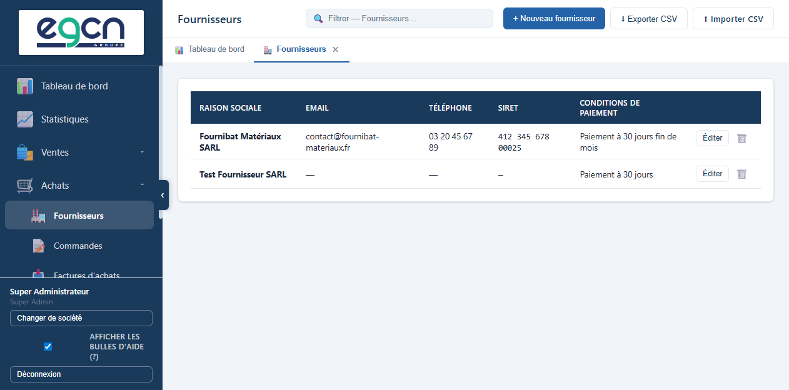

**Achats > Fournisseurs** liste l'ensemble de vos fournisseurs avec raison sociale, email, téléphone, SIRET et conditions de paiement.

Bouton **+ Nouveau fournisseur** pour ouvrir la fiche de création :

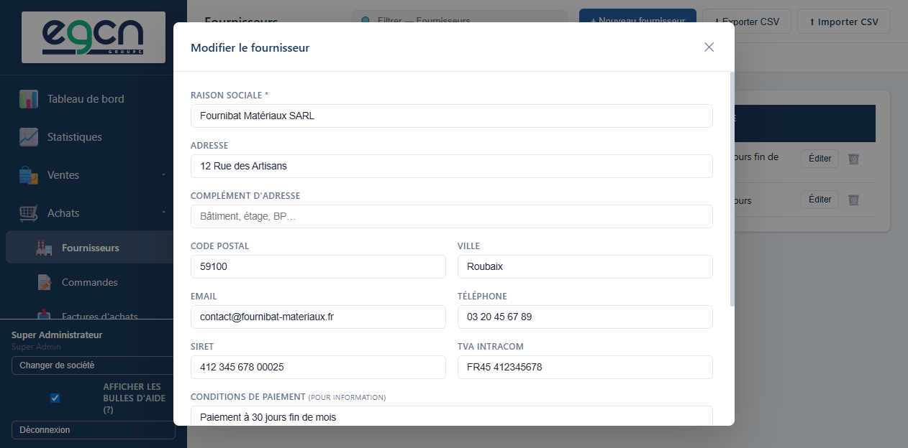

| Champ | Remarque |
|---|---|
| Raison sociale * | Obligatoire |
| Adresse / Complément / Code postal / Ville | Coordonnées postales |
| Email / Téléphone | Coordonnées de contact |
| SIRET / TVA Intracom | Identifiants légaux |
| Conditions de paiement | Texte libre, pour information uniquement |
| IBAN / BIC | Coordonnées bancaires pour vos virements, repliées dans **🏦 Coordonnées bancaires** |
| Notes | Texte libre |

Les boutons **⬇ Exporter CSV** et **⬆ Importer CSV** permettent d'échanger votre liste de fournisseurs au format tableur.

## Commandes (bons de commande)

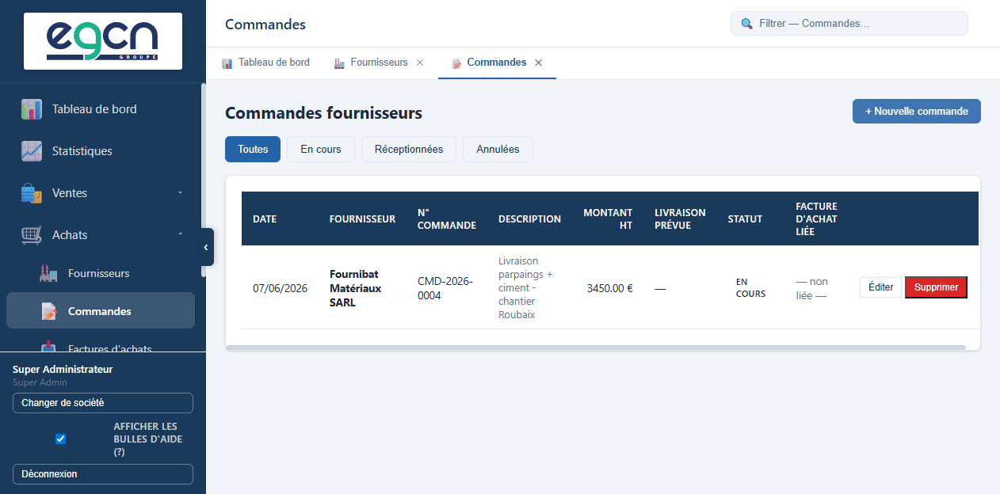

**Achats > Commandes** liste les bons de commande passés auprès de vos fournisseurs, filtrables par statut (**Toutes**, **En cours**, **Réceptionnées**, **Annulées**).

### Éditeur de bon de commande (v3.2.8)

Depuis la v3.2.8, les commandes s'éditent dans le **même éditeur WYSIWYG que les devis** : page A4 fidèle au PDF, lignes détaillées, totaux calculés en temps réel.

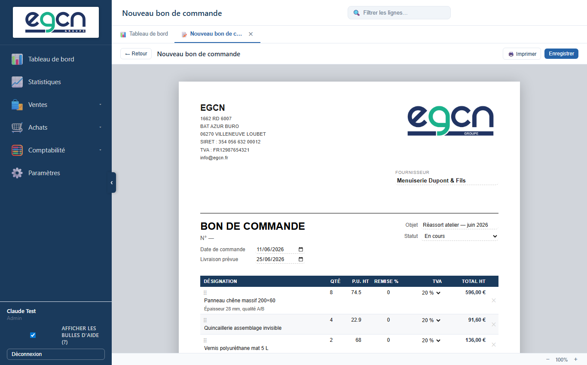

**+ Nouvelle commande** (ou **Éditer** sur une ligne de la liste) ouvre l'éditeur :

| Champ | Remarque |
|---|---|
| Fournisseur * | Recherche dans l'annuaire fournisseurs, **ou nom libre** (tapez simplement le nom sans sélectionner) |
| Date de commande * | Date de passation |
| Livraison prévue | Date estimée de réception |
| Objet | Objet de la commande |
| Statut | En cours / Réceptionnée / Annulée |
| Lignes | Désignation, description, quantité, P.U. HT, remise %, TVA — comme sur un devis |
| Notes | Instructions au fournisseur, imprimées en bas du PDF |

Le numéro `CMD-2026-0001` est attribué au premier enregistrement. **👁 Aperçu PDF** et **🖨️ Imprimer** génèrent le bon de commande à envoyer au fournisseur (sans CGV de vente ni cadre signature — ce sont des mentions de documents émis aux clients).

> **Prix d'achat automatique** : en insérant un article du catalogue dans une ligne, c'est son **prix d'achat HT** (et non son prix de vente) qui est pré-rempli, s'il est renseigné dans la fiche article.

### Envoyer la commande par email (v3.2.10)

Le bouton **✉ Envoyer** — disponible sur la ligne de la liste et dans la barre d'outils de l'éditeur (commande déjà enregistrée) — ouvre une fenêtre de confirmation avec l'**email du fournisseur pré-rempli** (si renseigné dans l'annuaire **Fournisseurs**). Validez pour envoyer le PDF du bon de commande en pièce jointe.

### Facturer une commande (v3.2.10)

Tant qu'aucune facture d'achat n'est liée, le bouton **🧾 → Facture d'achat** — sur la ligne de la liste et dans la barre d'outils de l'éditeur — ouvre l'éditeur de **facture d'achat pré-rempli** avec le fournisseur, l'objet et les lignes de la commande. Complétez le **N° de facture fournisseur** puis enregistrez : la commande est automatiquement **liée** à la nouvelle facture d'achat.

### Chaînage avec une facture d'achat

Le bouton **🔗** de la liste associe manuellement une commande à une facture d'achat existante (le chaînage automatique via **🧾 → Facture d'achat** ci-dessus produit le même lien). Ce chaînage est **non bloquant** : facultatif, modifiable à tout moment, sans incidence sur le scellement. Il aide à suivre le cycle commande → réception → facturation, sans imposer de contrainte d'ordre ni verrouiller les documents.

## Factures d'achats

**Achats > Factures d'achats** liste les factures reçues de vos fournisseurs, filtrables par statut **reçue** / **payée**.

### Éditeur de facture d'achat (v3.2.8)

La saisie se fait elle aussi dans l'éditeur WYSIWYG, sur une page A4 reprenant la structure de la facture reçue :

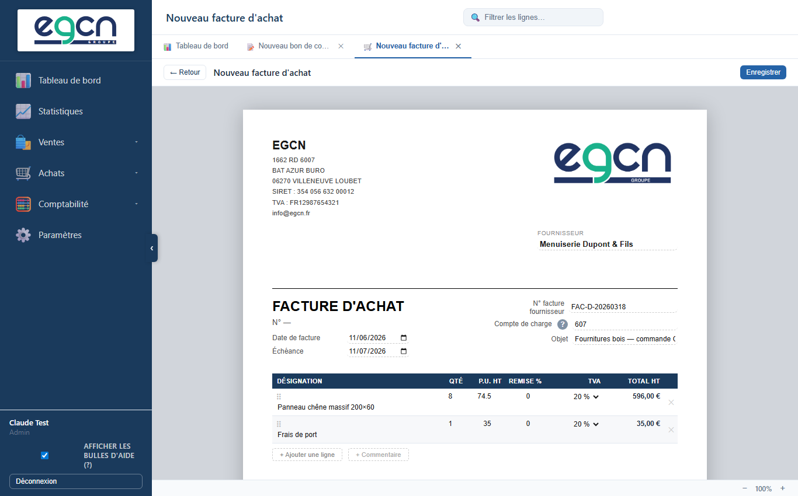

| Champ | Remarque |
|---|---|
| Fournisseur * | Annuaire ou nom libre |
| N° facture fournisseur * | Le numéro **figurant sur la facture reçue** (saisie libre — pas de numérotation FacturPro) |
| Date de facture * / Échéance | Dates du document reçu |
| Compte de charge | Compte 6xx imputé au débit (606 par défaut) |
| Lignes | Détail de la facture — les montants HT / TVA / TTC sont calculés depuis les lignes |

L'éditeur ne propose **ni aperçu ni impression PDF** : le document de référence est celui émis par le fournisseur, FacturPro ne fait que l'enregistrer.

### Comptabilité automatique

- L'**enregistrement** génère les écritures FEC du journal **AC** (compte 401 au crédit, charge 6xx au débit, TVA déductible 44566 au débit) et alimente la déclaration de TVA déductible du mois correspondant.
- Une facture **reçue** reste **modifiable** : la modification régénère les écritures FEC et resynchronise la TVA déductible (y compris en cas de changement de mois). C'est permis côté achats — contrairement aux documents émis, aucune obligation légale de verrouillage ne s'applique aux documents reçus.
- **💳 Payer** (dans l'éditeur ou la liste) écrit les écritures de règlement (journal **BQ**). Une facture **payée** passe en lecture seule.
- **Import CSV** permet d'importer un lot de factures au format FEC (lignes du compte 401).
- La suppression n'est possible que sur les factures au statut **reçue** : elle annule les écritures FEC et recalcule la TVA déductible du mois concerné.

---

# Statistiques


## KPIs (indicateurs clés)

Accessible via **📈 Statistiques**. Sélectionnez la période : mois, trimestre, ou année.

| Indicateur | Calcul |
|---|---|
| CA facturé HT | Somme HT des factures émises (hors avoirs) |
| CA encaissé | Somme TTC des factures payées |
| Montant moyen | CA facturé ÷ nombre de factures |
| En attente | Factures émises non payées, échéance non dépassée |
| En retard | Factures émises non payées, échéance dépassée |
| Taux de conversion | Devis acceptés ÷ devis envoyés |
| Délai moyen d'acceptation | Jours entre création et acceptation (180 j max) |

## Balance âgée

Créances non payées groupées par tranche :

| Tranche | Couleur |
|---|---|
| Non échu | Vert |
| 1 à 30 jours | Jaune |
| 31 à 60 jours | Orange |
| 61 à 90 jours | Orange foncé |
| Plus de 90 jours | Rouge |

## Évolution du CA

Graphique en barres sur 12 mois glissants : CA facturé vs CA encaissé.

## Pipeline commercial

Entonnoir brouillons → envoyés → acceptés → facturés, avec montants à chaque étape.

## Top clients et top articles

Top 10 clients par CA HT et top 10 articles sur l'année.

## Trésorerie et DSO

- **DSO** (Days Sales Outstanding) : délai moyen de paiement en jours.
- **Prévisions** : encaissements attendus groupés par semaine sur 90 jours.

## Taux de marge catalogue

Tableau des articles avec prix achat, taux de marque (rouge < 20%, orange < 40%, vert ≥ 40%).

---

# Déclaration TVA (CA3)


Accédez via **📑 Déclaration TVA**. Sélectionnez la période (mensuelle, trimestrielle, annuelle).

## Section A — TVA collectée (calculée automatiquement)

FacturPro calcule automatiquement depuis vos factures émises :

| Ligne | Contenu |
|---|---|
| Par taux | Base HT et TVA par taux (20%, 10%, 5,5%, 2,1%) |
| Avoirs émis | Montants à déduire |
| Franchise 293 B | Opérations non soumises |
| **Total TVA brute** | Somme des TVA collectées |
| **Total TVA nette** | Après déduction des avoirs |

## Section B — TVA déductible (saisie manuelle)

Depuis v2.13.0, **saisissez directement le montant** de TVA déductible sur vos achats dans le champ prévu. La valeur est **automatiquement enregistrée** par période et persist entre les sessions.

| Champ | Contenu |
|---|---|
| TVA déductible sur achats | Montant à saisir depuis vos factures d'achat |
| Notes | Commentaire libre pour votre comptable |

## Section C — Solde TVA à payer

Calculé automatiquement : **TVA collectée nette − TVA déductible = Solde à payer** (ou crédit de TVA si négatif).

> **Important :** Ce document est un outil d'aide au calcul. Vérifiez avec votre expert-comptable avant le dépôt officiel sur impots.gouv.fr.

---

# Exercices comptables


La clôture annuelle est **obligatoire** en droit français (art. L123-12 Code de Commerce et art. 88 loi 2015-1785 anti-fraude TVA).

## Ouvrir un exercice

1. Cliquez **+ Ouvrir cet exercice** dans la vue **📅 Exercices**.
2. Sélectionnez l'**année**.
3. Renseignez la **date de début** (défaut : 1er janvier de l'année sélectionnée).

> **Exercice non-civil :** Si votre exercice commence le 1er avril 2025 et se termine le 31 mars 2026, sélectionnez l'année 2025 et définissez la date d'ouverture au 01/04/2025.

## Clôturer un exercice

1. Cliquez **🔒 Clôturer** sur la ligne de l'exercice.
2. Une boîte de dialogue propose automatiquement la **date de clôture** calculée depuis la date d'ouverture (ex. 01/04/2025 → 31/03/2026).
3. Modifiez si nécessaire, puis confirmez.

La clôture est **irréversible**. Elle :

- Calcule l'**empreinte SHA-256** du FEC de l'exercice (identique au contenu exporté).
- Enregistre la date, le nombre d'écritures et l'empreinte.
- Génère un **Procès-Verbal de clôture** PDF téléchargeable.

> ⚠️ **La clôture ne peut pas être annulée.** Pour l'exercice en cours, attendez que toutes les factures soient saisies.

## Télécharger le FEC par exercice

Bouton **⬇ FEC 2025** → fichier texte tabulé `FEC_2025.txt` contenant uniquement les écritures de cet exercice, conforme DGFiP.

Vous pouvez aussi télécharger le FEC depuis **Factures > Export FEC** avec le filtre année : `?annee=2025`.

## Procès-Verbal de clôture (PV)

Bouton **📄 PV** → PDF A4 contenant :

- Raison sociale, SIRET
- Période fiscale
- Date et heure de clôture
- Nombre d'écritures comptables
- **Empreinte SHA-256** du FEC (preuve d'intégrité opposable)
- Référence légale : art. 88 loi 2015-1785 + art. 286-I-3° CGI
- Zone de signature

Ce document doit être **conservé** et peut être demandé lors d'un contrôle fiscal.

---

# Lettrage

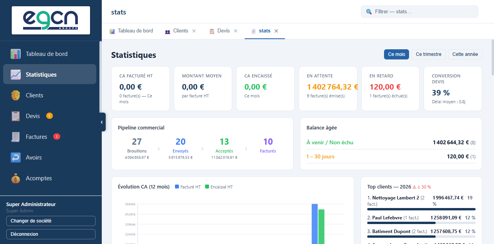

Le lettrage rapproche les écritures du compte 411 Clients : chaque débit (facture émise) est mis en regard de son crédit (paiement ou avoir).

## Lettrage automatique

| Événement | Effet |
|---|---|
| Facture marquée **payée** | Lignes 411 de l'émission + règlement → même lettre |
| **Avoir émis** sur une facture | Lignes 411 de la facture + avoir → même lettre |

## Lettrage manuel

1. Sélectionnez un client dans le filtre.
2. Cochez les lignes à rapprocher (débit = crédit à 0,01 € près requis).
3. Cliquez **Lettrer la sélection** — une lettre est attribuée (A, B… Z, AA…).
4. Bouton **Délettrer** pour annuler un lettrage erroné.

---

# Journal d'audit


Accessible via **🔍 Journal d'audit** (administrateurs uniquement). Affiche les 200 dernières actions sensibles :

| Action enregistrée | Détail |
|---|---|
| Connexion | Email, IP, horodatage |
| Émission de facture | Numéro de facture |
| Paiement de facture | Mode de paiement |
| Dépôt Chorus Pro | ID de dépôt |

---

# Archives


Accessible via **🗄️ Archives**. Affiche les snapshots JSON immuables de tous les documents fiscaux.

- Chaque document émis est archivé automatiquement avec un **hash SHA-256**.
- Conservation légale : **10 ans**.
- Lecture seule — modification et suppression impossibles (trigger DB).

---

# Relances automatiques (v2.13.0)

Une fois configurées dans **Paramètres > Relances automatiques**, FacturPro envoie automatiquement chaque jour un email de relance aux clients dont la facture est en retard.

## Comment ça fonctionne

1. Chaque jour à l'heure configurée (ex. 08:00), le serveur vérifie les factures `émises` dont l'échéance est dépassée depuis plus de N jours.
2. Pour chaque facture, il vérifie qu'aucune relance n'a été envoyée dans les N derniers jours.
3. Un email de relance est envoyé au client.
4. La date de dernière relance et le compteur sont mis à jour sur la facture.

## Email de relance automatique

L'objet de l'email est : `Relance — Facture FAC-2026-NNNN en attente de règlement`

Le corps mentionne : le numéro de facture, le montant TTC, la date d'échéance et le nombre de jours de retard.

## Suivi

Sur chaque facture en retard, vous pouvez voir :
- **Dernière relance** : date du dernier email envoyé
- **Nb relances** : nombre total de relances envoyées

---

# Gestion des utilisateurs

## Rôles

| Rôle | Droits principaux |
|---|---|
| `admin` | Tout : clients, documents, articles, paramètres, utilisateurs, sauvegardes |
| `comptable` | Clients + documents complets — pas de gestion utilisateurs ni sauvegardes |
| `commercial` | Clients + devis (lecture/écriture) + factures/BL/articles en lecture |
| `lecteur` | Lecture seule sur tout |
| `super_admin` | Passe outre toutes les permissions — gère plusieurs sociétés |

## Visibilité des commerciaux

Un commercial peut être configuré pour voir **uniquement ses propres devis et factures** (ceux qu'il a créés) ou **tous les documents de la société**. Ce paramètre se configure dans Paramètres > Utilisateurs, colonne **Voir tout**.

## Multi-société

Le super-administrateur peut gérer plusieurs entités depuis un seul compte :
- **Paramètres > Entreprise > Nouvelle société** pour créer une entité supplémentaire.
- Le commutateur de société apparaît lors de la connexion si plusieurs entités sont accessibles.

### Gestion des sociétés

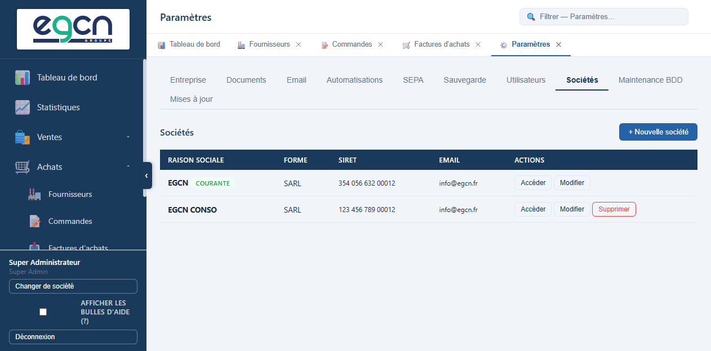

L'onglet **Paramètres > Sociétés** (super-administrateur) liste toutes les entités de l'instance avec leur raison sociale, forme juridique, SIRET et email :

| Action | Effet |
|---|---|
| **Accéder** | Bascule l'espace de travail courant vers cette société |
| **Modifier** | Édite raison sociale, forme juridique, SIRET, TVA intracom, adresse, email, téléphone |
| **+ Nouvelle société** | Crée une entité supplémentaire |
| **Supprimer** | Disponible uniquement sur les sociétés autres que la société courante (`COURANTE`) — suppression définitive de l'entité et de toutes ses données |

> La société marquée **COURANTE** ne peut pas être supprimée depuis cet écran.

---

# Sauvegardes

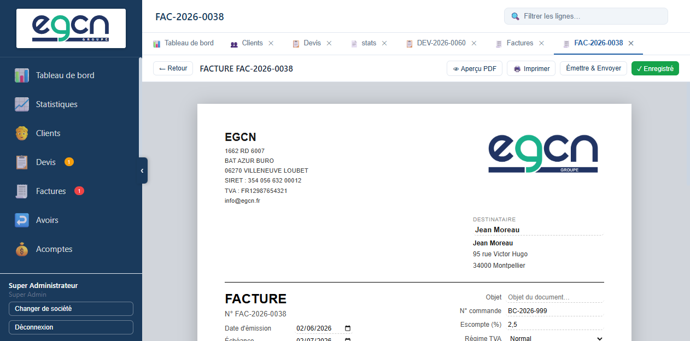

## Configuration (admin uniquement)

**Paramètres > Sauvegarde automatique**.

| Paramètre | Remarque |
|---|---|
| Répertoire de destination | Chemin local ou réseau (ex. `C:\Sauvegardes\FacturPro`) |
| Fréquence | Quotidienne, hebdomadaire, mensuelle |
| Heure | Heure locale du serveur |
| Taille max (Mo) | Alerte si le total des sauvegardes dépasse ce seuil |

Les sauvegardes sont des fichiers `.sql.gz` (compression gzip, ~6× de compression). Elles sont générées via `pg_dump`.

## Lancer une sauvegarde manuelle

Bouton **▶ Lancer maintenant**.

## Restaurer

La restauration se fait en ligne de commande (contactez votre administrateur) :

```bash
# Décompresser
gunzip sauvegarde.sql.gz

# Restaurer
psql -U facturpro -d facturpro -f sauvegarde.sql
```

## Vérification de restauration

Pour garantir qu'une sauvegarde est réellement utilisable en cas de besoin, FacturPro la restaure automatiquement dans une base temporaire (`facturation_verify`) et compte les factures qu'elle contient. Cette vérification s'exécute :

- **automatiquement** le 1er de chaque mois à 3h ;
- **à la demande**, via le bouton **🔎 Vérifier la dernière sauvegarde** (section *Vérification de restauration* de **Paramètres > Sauvegarde**).

Le résultat (date, succès/échec, nombre de factures, message d'erreur éventuel) est affiché dans cette même section.

> Réservé au super-administrateur. Nécessite que le rôle PostgreSQL de l'application dispose du droit `CREATEDB` (`ALTER ROLE <utilisateur> CREATEDB;`), sinon la vérification renvoie une erreur explicite.

## Sauvegarder et restaurer une société

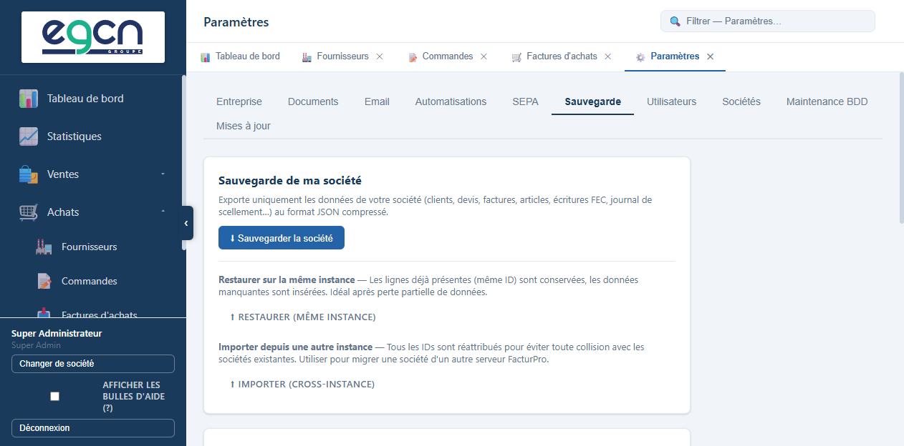

En complément de la sauvegarde complète de la base, **Paramètres > Sauvegarde > Sauvegarde de ma société** exporte uniquement les données de la société active (clients, devis, factures, articles, écritures FEC, journal de scellement, logo…) au format JSON compressé (`.json.gz`).

| Bouton | Usage |
|---|---|
| **⬇ Sauvegarder la société** | Télécharge l'export JSON compressé de la société courante |
| **⬆ Restaurer (même instance)** | Réinjecte une sauvegarde sur la même instance — les lignes déjà présentes (même ID) sont conservées, seules les données manquantes sont insérées. Idéal après une perte partielle de données |
| **⬆ Importer (cross-instance)** | Importe une société exportée depuis un autre serveur FacturPro — tous les identifiants sont réattribués pour éviter toute collision avec les sociétés existantes |

> Les options de restauration/import sont réservées au super-administrateur.

## Maintenance de la base de données

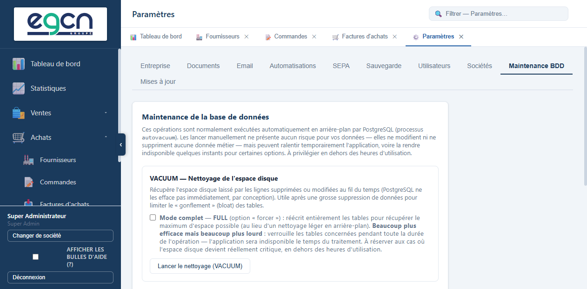

**Paramètres > Maintenance BDD** propose un nettoyage manuel de l'espace disque (`VACUUM`), normalement géré automatiquement en arrière-plan par PostgreSQL (processus *autovacuum*).

- Lancer ce nettoyage manuellement ne modifie ni ne supprime aucune donnée métier — il récupère simplement l'espace disque laissé par les lignes supprimées ou modifiées.
- L'opération peut ralentir temporairement l'application ; à privilégier en dehors des heures d'utilisation.
- L'option **Mode complet (FULL)** réécrit entièrement les tables pour récupérer le maximum d'espace possible, mais verrouille les tables concernées pendant toute la durée du traitement (l'application devient indisponible). À réserver aux cas où l'espace disque devient critique.

---

# Conformité fiscale

## Chaîne de scellement SHA-256

Chaque document fiscal émis est chaîné par un hash SHA-256 cumulatif dans la table `journal_scellement`. Pour vérifier l'intégrité :

**Factures > Vérifier le scellement** → retourne ✓ si la chaîne est intacte, ou identifie le premier document altéré.

Cette vérification prouve que les données n'ont pas été modifiées après émission, même directement dans la base.

## Export FEC global

**Factures > Export FEC** → fichier texte tabulé DGFiP `FEC_YYYY-MM-DD.txt` (toutes les écritures de toutes les années).

Pour un export par exercice : **Exercices > ⬇ FEC 2025**.

## Format Factur-X EN 16931

Chaque facture émise est un **PDF/A-3b** avec un fichier XML ZUGFeRD embarqué conforme au profil EN 16931. Ce format est :

- Lisible directement par les logiciels comptables (Sage, EBP, Cegid, Pennylane…).
- Compatible avec l'e-invoicing européen (e-Reporting, PPF).
- Obligatoire à partir de 2026 pour les transactions B2B en France.

L'XML contient notamment :
- Identités vendeur/acheteur avec SIRET et TVA intracom
- Lignes de facture détaillées
- Montants HT/TVA/TTC
- Conditions de paiement et escompte
- N° de commande client (BuyerReference)
- Pénalités de retard

## Attestation de conformité

**Factures > Attestation** → document HTML imprimable attestant la conformité du logiciel à la loi anti-fraude TVA 2018. Peut être demandé par l'administration fiscale.

---

# Attestation loi anti-fraude TVA 2018

FacturPro satisfait aux conditions de l'article 88 de la loi n° 2015-1785 du 29 décembre 2015 de finances pour 2016 par les mécanismes suivants :

| Condition légale | Implémentation technique |
|---|---|
| **Inaltérabilité** | Triggers `BEFORE UPDATE` bloquant toute modification d'un document émis |
| **Sécurisation** | Chaîne SHA-256 dans `journal_scellement` — toute altération détectable |
| **Conservation** | Archivage automatique des snapshots JSON, 10 ans, immuable |
| **Archivage** | Table `archive_documents` avec triggers bloquant UPDATE/DELETE |
| **Clôture de période** | Table `exercices` avec hash SHA-256 du FEC à la clôture |
| **PV de clôture** | PDF horodaté et signable, référence légale incluse |

---

*Document généré par FacturPro v3.0.0 — 2026*
